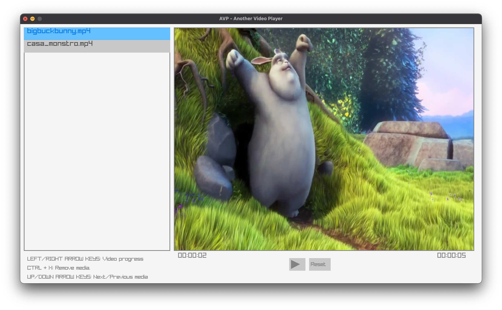

## AVP - Another Video Player

This is a simple video player application built with C that leverages two amazing resources: Raylib and FFMpeg. The application allows its users
to play videos, pause them, add multiple videos to a queue and switch between them.

This project was built so I could understand how can one interact with audio and video on a lower level (mainly by using FFMpeg's libav functions).
I've also gained some good experience in building GUI interfaces using Raylib, which is an good choice for this matter.

